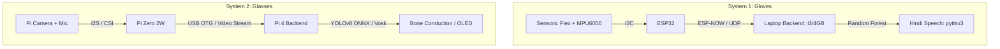

## 💰 Bill of Materials (BOM)

| Component | Subsystem | Interface / Protocol | Estimated Cost (INR) | Purpose |
| :--- | :--- | :--- | :--- | :--- |
| **ESP32 DevKit V1** (x2) | Gloves | ESP-NOW / I2C / DAC | ₹750 | Main glove microcontrollers |
| **ADS1115 16-Bit ADC** | Gloves | I2C (0x48) | ₹250 | High-res analog flex sensor parsing |
| **MPU6050 IMU** (x2) | Both | I2C (0x68) | ₹300 | Kinematic tracking & gesture trigger |
| **PAM8403 Amplifier + Speaker** | Gloves | Analog (DAC Pin) | ₹150 | Local audio generation for TTS |
| **Raspberry Pi Zero 2W** | Glasses | CSI / I2S / USB OTG | ₹1,600 | Wearable video/audio capture hub |
| **Raspberry Pi 4 (2GB)** | Glasses | ONNX / OpenCV Engine | ₹3,800 | Compute backend (carried in pocket) |
| **Pi Camera NoIR V2** | Glasses | CSI Ribbon Cable | ₹1,200 | Low-light capable computer vision sensor |
| **INMP441 Microphone** | Glasses | I2S Digital Bus | ₹220 | High-fidelity offline voice command capture |
| **SSD1306 OLED + Prism** | Glasses | I2C (0x3C) | ₹350 | Heads-Up Display (HUD) optics assembly |
| **Bone Conduction Transducer**| Glasses | Audio Jack / GPIO | ₹400 | Non-blocking auditory feedback channel |
