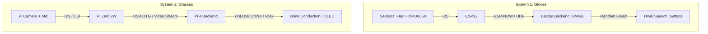

```mermaid
graph TD
    subgraph System 1: Gloves
    A[Sensors: Flex + MPU6050] -->|I2C| B[ESP32]
    B -->|ESP-NOW / UDP| C[Laptop Backend: i3/4GB]
    C -->|Random Forest| D[Hindi Speech: pyttsx3]
    end

    subgraph System 2: Glasses
    E[Pi Camera + Mic] -->|I2S / CSI| F[Pi Zero 2W]
    F -->|USB OTG / Video Stream| G[Pi 4 Backend]
    G -->|YOLOv8 ONNX / Vosk| H[Bone Conduction / OLED]
    end
```
